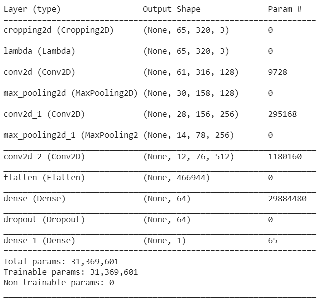
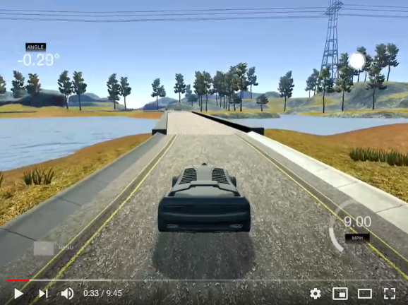

<H3>Behavioral cloning project</H3>

<H5>Overview</H5>  
The idea of this project is to clone human's behavior on the road. First we have to ride several laps and to collect data: images that are made with camera mounted on a bonnet and steering angle. Than the CNN will have to predict the steering angle of the car.  

CNN architecture:  
</img>  

Watch video:  

